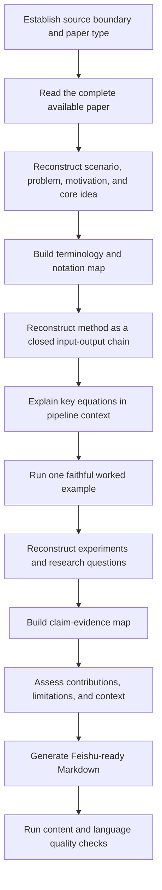

# Paper Deep Reader

> Turn research papers into closed-loop learning notes, with preserved terminology, explicit evidence, and Feishu-ready Markdown.

[中文说明](README.zh-CN.md)

Paper Deep Reader is an open Markdown skill for deeply studying academic papers. It reconstructs the complete line from research scenario to method and evidence. It also explains terminology, notation, equations, algorithm stages, experiments, limitations, and research context.

## Why this project exists

Many paper tools produce compressed summaries. Researchers often need a different output:

- a precise statement of the scenario and problem;
- a complete method flow from input to output;
- original terminology and symbols;
- plain-language explanations;
- a worked example that follows the real procedure;
- a full experimental protocol;
- a claim-evidence map;
- a note that can be pasted into Feishu and revisited later.

Paper Deep Reader is designed around those requirements.

## Core features

- **Closed-loop method reconstruction**: every stage records input, operation, output, purpose, and next consumer.
- **Terminology and notation map**: preserves the paper’s original vocabulary and symbols.
- **Equation-in-context explanations**: explains selected equations inside the method pipeline.
- **Faithful worked example**: runs one constructed example through the complete procedure.
- **Experiment reconstruction**: extracts research questions, protocol, baselines, metrics, results, and ablations.
- **Claim-evidence audit**: maps every major claim to its supporting evidence.
- **Source-status labels**: separates paper statements, explanations, interpretations, and external context.
- **Feishu-ready output**: uses concise Markdown with controlled tables and heading depth.
- **Language quality gate**: checks generic AI phrasing, unsupported claims, placeholders, and missing sections.
- **Paper-type adaptation**: supports empirical, theoretical, systems, survey, and position papers.

## Workflow



A detailed version is available in [docs/WORKFLOW.md](docs/WORKFLOW.md).

## Repository layout

```text
paper-deep-reader/
├── SKILL.md
├── README.md
├── README.zh-CN.md
├── templates/
├── docs/
├── examples/
├── eval/
├── config/
├── scripts/
├── tests/
└── .github/
```

## Quick start

1. Load `SKILL.md` in an agent that supports custom Markdown skills.
2. Provide a paper PDF, URL, or text.
3. Use a prompt such as:

```text
Use paper-deep-reader to study this paper. Produce a Chinese Feishu-ready deep note.
Preserve the original terminology and notation. Reconstruct the full training and
inference flow, explain the key equations, and include one faithful worked example.
```

The exact loading mechanism depends on the host agent. The skill itself has no runtime dependency.

## Templates

- `templates/feishu-deep-note.zh-CN.md`: default Chinese deep note.
- `templates/feishu-deep-note.en.md`: default English deep note.
- `templates/quick-read.zh-CN.md`: compact triage note.
- `templates/literature-matrix.zh-CN.md`: multi-paper extraction for literature reviews.

## Quality checker

The repository includes a dependency-free Python checker:

```bash
python scripts/validate_note.py path/to/note.md
```

It checks:

- required note sections;
- prohibited AI-style templates;
- vague performance claims;
- unresolved placeholders;
- excessively long sentences;
- evidence-anchor presence;
- reintroduced “What to Remember” sections.

Use JSON output when integrating with another tool:

```bash
python scripts/validate_note.py path/to/note.md --json
```

Use `--fail-on-warning` in automated quality gates:

```bash
python scripts/validate_note.py path/to/note.md --fail-on-warning
```

## Example

The `examples/toy-paper/` directory contains a synthetic paper brief and a complete Chinese note. The example is fictional and exists only to demonstrate the output contract.

## Design boundary

The default output is a learning note. Venue scoring and accept/reject recommendations are optional and appear only when explicitly requested.

External literature can be added, but it must be labeled as external context. Missing information remains missing; the skill does not invent hyperparameters, results, or implementation details.

## Evaluation

See:

- [Evaluation rubric](eval/RUBRIC.md)
- [Final checklist](eval/CHECKLIST.md)
- [Test prompts](eval/TEST_PROMPTS.md)

## Roadmap

See [ROADMAP.md](ROADMAP.md) for planned evaluation, code-alignment, and literature-synthesis extensions.

## Publishing

A repository release checklist is available in [docs/PUBLISHING.md](docs/PUBLISHING.md).

## Contributing

Contributions are welcome. Read [CONTRIBUTING.md](CONTRIBUTING.md) before adding templates, language rules, or examples.

## Citation

Repository citation metadata is provided in [CITATION.cff](CITATION.cff).

## License

MIT License. See [LICENSE](LICENSE).
