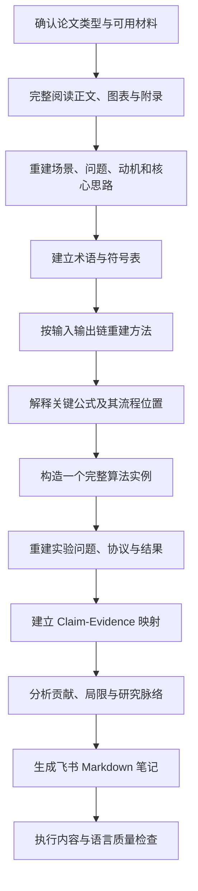

# Paper Deep Reader

> 将论文整理为逻辑闭环、术语完整、证据清楚、可直接放入飞书的研究笔记。

[English README](README.md)

Paper Deep Reader 是一个面向论文精读的开源 Markdown Skill。它围绕“场景与问题、完整方法流程、术语与符号、实验设置、结果证据”组织输出，适合学习新技术、沉淀论文笔记，也可以为后续文献综述提供统一的单篇论文结构化材料。

## 项目解决什么问题

常见论文总结会压缩方法细节，术语和符号容易丢失，实验部分也常停留在数据集与最终指标。研究者更需要下面这些内容：

- 论文面向什么场景，解决什么具体问题；
- 现有路线的限制和作者的 motivation；
- 方法从输入到输出如何运行；
- 训练流程与推理流程如何区分；
- 关键术语、符号和公式各自承担什么作用；
- 一个可手工走通的算法实例；
- 实验协议、基线、指标、主结果和消融；
- 每个核心 claim 由哪项证据支撑；
- 作者明确说明的局限与可合理推断的边界；
- 可直接复制到飞书的 Markdown 笔记。

## 核心能力

- **闭环方法重建**：每一步都写清输入、操作、输出、目的和下一步。
- **术语与符号保留**：保留论文原始术语、缩写和数学符号。
- **公式位置化解释**：公式跟随方法流程解释，避免脱离上下文。
- **完整实例演示**：用构造数据走完真实算法，展示中间结果。
- **实验问题重建**：说明作者希望通过每组实验回答什么问题。
- **Claim-Evidence 映射**：把核心论断和表格、图、定理、消融逐项对应。
- **来源状态区分**：区分论文原文、通俗解释、研究解读和外部背景。
- **飞书友好格式**：控制标题层级、段落长度和表格使用。
- **语言质量检查**：检测典型 AI 模板句、空泛评价、占位符和结构缺失。
- **论文类型适配**：覆盖实证、理论、系统、综述和观点类论文。

## Workflow



详细流程见 [docs/WORKFLOW.md](docs/WORKFLOW.md)。

## 仓库结构

```text
paper-deep-reader/
├── SKILL.md                  # Skill 主文件
├── README.md
├── README.zh-CN.md
├── templates/                # 深度笔记、快速阅读、综述矩阵
├── docs/                     # Workflow、输出规范、语言风格
├── examples/                 # 合成论文示例
├── eval/                     # 评分量表与测试提示词
├── config/                   # 自动检查规则
├── scripts/                  # Markdown 笔记检查脚本
├── tests/                    # 检查脚本测试
└── .github/                  # Issue、PR 与 CI 配置
```

## 使用方式

将 `SKILL.md` 放入支持自定义 Skill 的 Agent 中，随后提供论文 PDF、链接或正文。宿主平台的加载方式可能不同，这个仓库本身不依赖特定模型或运行时。

推荐提示词：

```text
使用 paper-deep-reader 深度阅读这篇论文，输出中文飞书笔记。
保留原始术语和符号。完整说明研究场景、问题、方法和实验。
区分训练与推理流程，解释关键公式，并给出一个可走通的构造实例。
所有核心结论都标注 Section、Equation、Figure 或 Table 位置。
```

## 输出模板

- `templates/feishu-deep-note.zh-CN.md`：默认中文深度笔记。
- `templates/feishu-deep-note.en.md`：默认英文深度笔记。
- `templates/quick-read.zh-CN.md`：论文初筛笔记。
- `templates/literature-matrix.zh-CN.md`：多篇论文综述矩阵。

默认结构中不设置 `What to Remember`。摘要、贡献、结果和 Claim-Evidence 已经覆盖复习所需信息，额外的记忆清单容易产生重复。

## 自动检查

运行：

```bash
python scripts/validate_note.py path/to/note.md
```

检查内容包括：

- 核心章节是否完整；
- 是否出现禁用的 AI 模板句式；
- 性能评价是否缺少数字或统计依据；
- 是否残留 TODO、TBD 和模板占位符；
- 中英文句子是否过长；
- 是否包含来源锚点；
- 是否重新加入了已移除的记忆清单章节。

需要结构化结果时使用：

```bash
python scripts/validate_note.py path/to/note.md --json
```

在自动化质量检查中，可将警告视为失败：

```bash
python scripts/validate_note.py path/to/note.md --fail-on-warning
```

## 示例与评测

`examples/toy-paper/` 提供一份虚构论文摘要和对应的中文深度笔记，用于展示完整输出结构。该示例中的论文、数据和结果均为构造内容。

质量标准见：

- [评分量表](eval/RUBRIC.md)
- [交付检查清单](eval/CHECKLIST.md)
- [测试提示词](eval/TEST_PROMPTS.md)

## 后续方向

版本规划见 [ROADMAP.md](ROADMAP.md)，仓库发布检查见 [docs/PUBLISHING.md](docs/PUBLISHING.md)。

## 开源信息

- 贡献说明：[CONTRIBUTING.md](CONTRIBUTING.md)
- 引用信息：[CITATION.cff](CITATION.cff)
- 许可证：[MIT License](LICENSE)
