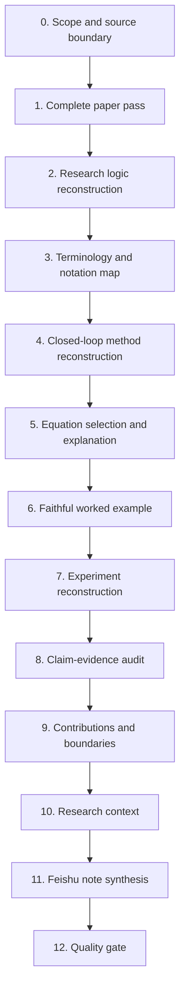

# Workflow

## Overview



## 0. Scope and source boundary

Record:

- available paper version;
- main text, appendix, supplementary material, code, and project page;
- unreadable or missing sections;
- user language;
- requested depth;
- whether external literature search is permitted.

This prevents unsupported details from entering the note.

## 1. Complete paper pass

Read the complete available source. Inspect:

- abstract and introduction;
- related work;
- problem formulation;
- method;
- algorithms;
- equations;
- figures and captions;
- experiments;
- tables and plots;
- discussion and limitations;
- conclusion;
- appendix and supplementary material.

Do not form a final interpretation from the abstract alone.

## 2. Research logic reconstruction

Build the following chain:

```text
Scenario
  ↓
Task
  ↓
Existing approach
  ↓
Observed limitation
  ↓
Research gap
  ↓
Core idea
  ↓
Proposed method
  ↓
Reported result
```

Check each arrow. Missing links should be marked as unclear.

## 3. Terminology and notation map

Create two inventories.

### Terms

```text
Term
├── Formal definition
├── Role in this paper
├── Plain-language explanation
├── Related concepts
└── Source anchor
```

### Symbols

```text
Symbol
├── Meaning
├── Type or dimension
├── First-use location
├── Dependency
└── Pipeline role
```

Preserve the paper’s notation. Flag collisions and inconsistent definitions.

## 4. Closed-loop method reconstruction

Use the method type that fits the paper.

### Static model or architecture

```text
Input → Encoder → Intermediate representation → Core module → Decoder → Output
```

### Iterative algorithm

```text
Initialization → State update → Decision → Feedback → Next state → Stop → Output
```

### Agent system

```text
Observation → State/Memory → Planning → Action/Tool → Feedback → Memory update → Termination
```

### Optimization method

```text
Variables + Objective + Constraints → Solver/Update → Feasibility check → Convergence → Solution
```

### Generative method

```text
Condition/Data → Training objective → Learned model → Sampling procedure → Generated output
```

For every node, record Input → Operation → Output → Purpose → Next Step.

## 5. Equation selection and explanation

Select equations that define the problem, model, objective, update, inference, or paper-specific metric.

For each equation:

```text
Original equation
  ↓
Symbol definitions
  ↓
What is computed
  ↓
Why the computation is needed
  ↓
Pipeline position
  ↓
Plain-language intuition
  ↓
Assumptions and constraints
```

## 6. Faithful worked example

Use a small constructed input. Carry it through every stage. Show intermediate variables and state changes.

The example must:

- use paper terminology;
- respect algorithm order;
- include a final output;
- label invented values;
- avoid presenting invented results as paper evidence.

## 7. Experiment reconstruction

Start from research questions.

```text
RQ
  ↓
Dataset or environment
  ↓
Protocol
  ↓
Baselines
  ↓
Metrics
  ↓
Result
  ↓
Interpretation
  ↓
Supported claim
```

Record training and inference details, data splits, seeds, repeated runs, compute, and statistical reporting when available.

## 8. Claim-evidence audit

Create a table:

| Claim | Evidence | Result | Support strength | Anchor |
|---|---|---|---|---|

Support strength uses:

- **Strong**: direct and appropriately controlled evidence.
- **Partial**: relevant evidence with limited coverage.
- **Weak**: indirect, confounded, or under-specified evidence.
- **Unverified**: no supporting evidence found in the available source.

## 9. Contributions and boundaries

Separate:

- author-claimed contributions;
- technical mechanism;
- empirical findings;
- theoretical results;
- engineering contributions;
- author-stated limitations;
- inferred limitations;
- failure cases;
- reproducibility gaps.

## 10. Research context

When evidence is available:

```text
Prior work → Retained component → Changed component → New capability → Remaining gap
```

Label information from outside the paper as external context.

## 11. Feishu note synthesis

Use short headings and compact paragraphs. Keep long reasoning outside tables. Place source anchors near the supported statement.

## 12. Quality gate

Run the checklist in `eval/CHECKLIST.md` and the automatic checker:

```bash
python scripts/validate_note.py path/to/note.md
```
